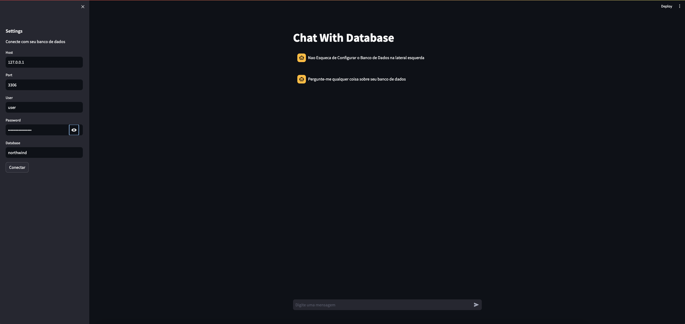

# Python Chat Natural Language to Sql
Demo: https://sql.midashub.com.br/



## Create Env File .env

### Add Environments variables
- OPENAI_API_KEY

## Run

## Requirements
- Make
- Python


## Create Environment

```bash
    python3 -m virtualenv venv
```

Activate Environment 

```bash
    source venv/bin/activate 
```
Install Dependencias

```bash
  pip install -r requirements.txt
```


Start Service

```bash
  make run
```
Or
```bash
  streamlit run src/main.py
```


